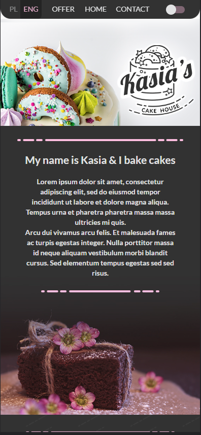
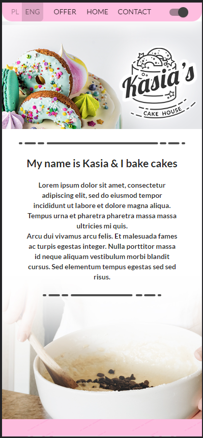
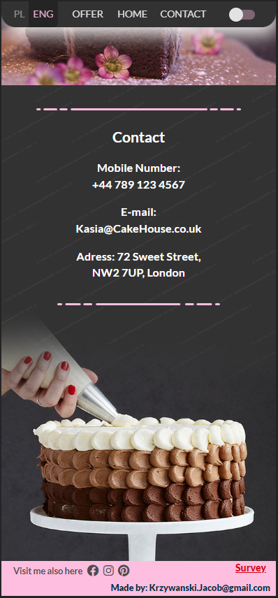
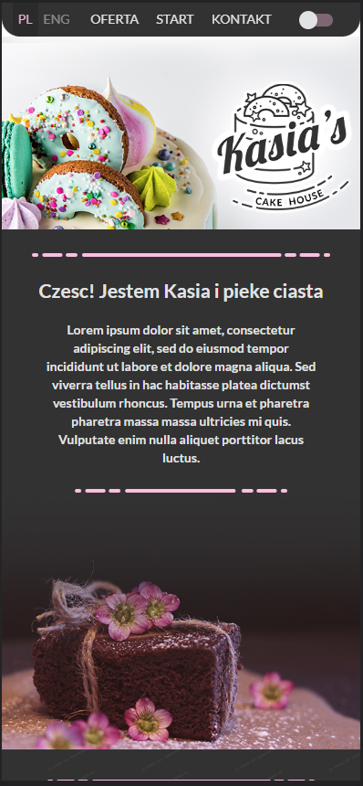

# CakeHouse 
### Single page mobile application for small bakery
## Technology: 
> ReactJS
>
> BEM
>
> Redux
>
> Sass
>
> Material UI
>
> React Scripts

## Screenshots from mobile view

## Summary

#### To run Cakehouse simply download it to your machine and start it with **npm start**

#### Building CakeHouse webapp helped me to understand BEM methodology and usage of Redux. It was challenging to create toggles for language and dark/light theme from scratch.

### Todo

#### Toggle to switch labels to etykiety (connect toggle and contact)

#### background-image (saved in style.scss, use at "home" -> index.jsx)

#### scroll-up button at bottom (privacy-policy -> index.jsx)

####
